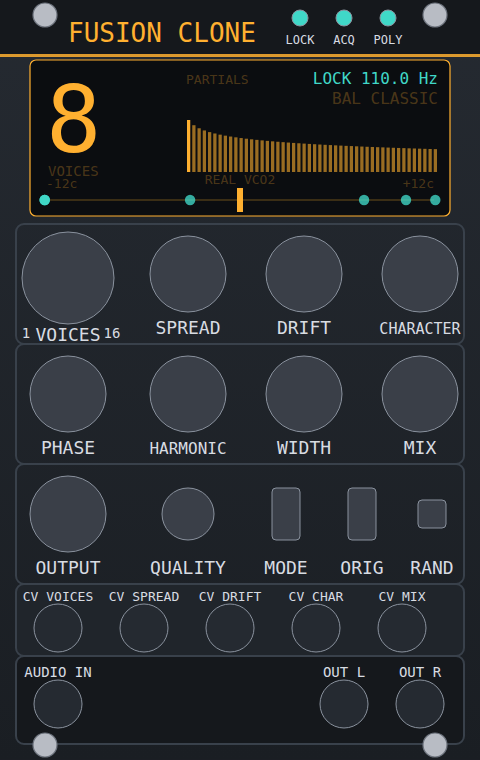

# Fusion Clone — one real Fusion VCO2 in, up to sixteen virtual VCO2s out

**Fusion Clone** is a VCV Rack 2 module for one job: you patch the audio output of **one real Erica Synths Fusion VCO2** (a hardware
module, or any monophonic oscillator) into it, and it produces the *perceptual equivalent* of 1 … 16 independent Fusion-VCO2-like
oscillators playing the same note — **the original plus up to 15 clones, never replacing the original**.

It is an **audio-domain processor placed after the real oscillator**. It does not need any other Fusion module, any control voltage from
the oscillator, or any knowledge of the oscillator's internals. It reads the periodic structure of the sound (period-synchronous harmonic
analysis) and re-synthesises independent, slowly drifting oscillators from it (a free-running wavetable oscillator bank). It is *not* a
chorus, a generic pitch shifter, a supersaw or a phase-vocoder effect — see `docs/ARCHITECTURE.md` for why those were tried and rejected.

> **Scientific limitation, stated plainly.** The clones are equivalent to real additional oscillators **perceptually and statistically**
> (independent detune and slow drift, decorrelated phase, correlated harmonic divergence, per-voice level and colour tolerance, the same
> spectral colour as the source including its tube saturation and sub). They are **not electrically identical** to additional hardware
> oscillators: they contain no VCO2 circuit model, and whatever the source signal does not reveal (for example a detune sideband that only
> exists in the original) is inherited coherently by the clones. Details in `docs/ARCHITECTURE.md` §9.

> **Status of this code base (read before relying on it).** It was written and tested in a Linux sandbox without audio hardware, without a
> real Fusion VCO2 and without the Rack GUI. What was actually verified: the DSP core (unit and integration tests, lock-robustness matrix,
> dynamics tests, benchmarks), a headless instantiation of the real `Module` class against Rack's engine classes (parameter/CV mapping,
> patch save/load), and a compile-check of all plugin sources against the Rack 2 headers. What was **not** verified: linking against the real
> Rack SDK, running in the Rack GUI, the macOS/Apple-silicon build, real-time CPU on the target machine, and — most importantly — listening.
> The perceptual claims rest on objective proxy metrics measured on a *synthetic hypothesis model* of the source (`docs/RESEARCH.md`),
> not on recordings of the real module. `docs/REFERENCE_PROTOCOL.md` explains how to close that gap with a real Fusion VCO2.

## Panel



*(Layout preview generated by `tools/preview_panel.py` from `src/PanelLayout.hpp` and `res/FusionClone.svg`: widget positions, labels and section frames are real; the display window is drawn at run time by the module and is empty here. It is not a screenshot of Rack.)*

| Control | Range / default | What it does |
|---|---|---|
| **VOICES** (big knob, digital read-out) | 1 … 16, default 8 | Number of oscillators heard: **1 = the original only**, N = the original + N−1 clones. Existing clones never move when the count changes (their detune positions are a prefix-stable sequence). |
| **SPREAD** | 0 … 100 %, default 35 % | Detune of the clones (nonlinear curve, expert range 5–60 cents at 100 %). 0 % puts every clone exactly on the original pitch. |
| **DRIFT** | 0 … 100 %, default 25 % | Slow, bounded, independent pitch/level/tilt instability per clone (Ornstein–Uhlenbeck). 0 % = perfectly still. |
| **CHARACTER** | 0 … 100 %, default 30 % | Per-voice level and colour tolerance, subtle static asymmetric saturation (HIGH / ULTRA), a trace of white pitch jitter. |
| **PHASE** | 0 … 100 %, default 60 % | Start-phase divergence of the clones (0 = phase-aligned with the source at lock, 100 % = fully random phases). |
| **HARMONIC** | 0 … 100 %, default 30 % | Smooth, correlated divergence of the harmonic amplitudes (a slowly varying spectral tilt / formant-like ripple per clone), *not* per-partial noise. |
| **WIDTH** | 0 … 100 %, default 0 % | Stereo spread of the clones. **Mono compatible for any setting** (L + R equals the mono sum). |
| **MIX** | 0 … 100 %, default 100 % | Dry (original only) to full population. |
| **OUTPUT** | −24 … +12 dB | Output trim. |
| **QUALITY** | ECO / BALANCED / HIGH / ULTRA | Analysis window (2 or 4 periods), interpolation kernel, table size, update rate. Higher = cleaner low notes and higher harmonic resolution, slower bloom-in, more CPU. |
| **MODE** | CLASSIC / FUSION | CLASSIC = pure partial cloning. FUSION adds a small per-voice detune-cluster layer (the DETUNE behaviour described in the manufacturer's text, see the context menu). |
| **ORIG** | off / on | Original only (A/B and debugging). |
| **RAND** | button | New random population (deterministic per-voice seeds; the seed is saved with the patch). |
| Lights (header) | LOCK / ACQ / POLY | LOCK = periodic structure found, clones active. ACQ = still acquiring / bypassing to the original. POLY = polyphonic cable connected: **only channel 1 is processed**. |

Inputs: **AUDIO IN** (the Fusion VCO2 OUT, nominal ±5 V), **CV** for VOICES (0 … 10 V sweeps 1 … 16, quantised), SPREAD, DRIFT, CHARACTER,
MIX (0.1 per volt, added to the knob). Outputs: **OUT L**, **OUT R** (both carry the mono sum at WIDTH 0). The display shows the voice count,
the lock state and pitch, the source's harmonic spectrum and the clones' detune positions.

The context menu holds the *expert* controls (detune range, spread curve, drift rate and inter-voice correlation, Fusion-cluster amount and
shift model **RATIO / HZ**, analog summing saturation, level law), *Randomize seeds* and read-outs (lock frequency, bloom time).

### Behaviour worth knowing

* **The original path has exactly zero latency**, and VOICES = 1 (or MIX = 0) is bit-transparent apart from OUTPUT.
* The clones **bloom in** after a note starts or its pitch steps: the analyser needs a few periods of clean signal. The original is heard
  meanwhile, at constant total power (there is no level bump when the clones arrive). Bloom time scales with the period: about 10 ms at 1.7 kHz
  to a few hundred ms at 20 Hz, depending on QUALITY (`docs/BENCHMARKS.md`). Gliding and vibrato are tracked by the analyser's frequency
  filter without unlocking; a pitch step or a waveform change re-acquires.
* A **sub oscillator** (the composite repeats every two main cycles) is detected automatically, also when the SUB knob is turned up during a
  note; the tube saturation and detune sidebands of the source are part of the spectrum that gets cloned.
* **Failure modes** are graceful: silence, DC, noise, out-of-range levels, NaN/Inf and disconnected input produce clean output (the original,
  or silence) and never a stuck or exploding state; polyphonic input uses channel 1.

## Build and install

Requirements: the **Rack 2 SDK** for your platform (https://vcvrack.com/manual/Building), a C++11 compiler (the Rack toolchain). Nothing else.

```sh
export RACK_DIR=/path/to/Rack-SDK        # e.g. ~/Rack-SDK-2.x.x-mac-arm64 on an Apple-silicon Mac
cd fusion-clone
make -j$(nproc 2>/dev/null || sysctl -n hw.ncpu)
make install                              # copies plugin into your Rack user plugin folder
make dist                                 # optional: builds a distributable .vcvplugin
```

The DSP core is header-only C++11, framework independent, allocation-free in `process()` and uses no locks in the audio thread. By default it
uses the **pffft** that Rack bundles as its FFT backend (`-DFC_FFT_PFFFT` in the `Makefile`, with a plugin-owned work buffer so that pffft never
`alloca()`s on the audio thread's stack). If your SDK build does not export the pffft symbols, use `-DFC_FFT_RACK` (Rack's own `RealFFT`
wrapper) or drop the define to fall back to the built-in radix-2 FFT (slower but dependency free): edit `FLAGS` in the `Makefile`.

## Tests, tools and benchmarks (no Rack needed for these)

```sh
make -C tests                 # every DSP test with the portable FFT (about ten minutes: components, lock matrix, dynamics, engine, real-time)
make -C tests quick           # component tests only (FFT, sinc, Hilbert, tracker, analyser), seconds
make -C tests realtime        # allocation counter + per-sample cost of the audio path
tests/build_module_test.sh    # headless test of the real Module class (needs a Rack source checkout, see the script)
make -C tools                 # fusionclone_cli (offline renderer / A-B ladder) and bench (CPU per quality x voices x pitch, bloom table)
python3 tools/preview_panel.py                  # panel layout preview + overlap / frame / screw checks
python3 tools/analyze_reference.py rec.wav --f0 65.406     # spectrum/sideband report of a recording
python3 tools/fusion_detune_probe.py rec.wav --f0 65.406   # RATIO (Doppler) or HZ (SSB) detune? see docs/REFERENCE_PROTOCOL.md
```

`fusionclone_cli in.wav out.wav [options]` runs the same engine offline; `--ab dir` writes an A/B ladder (original, +1 … +15 clones) to
listen to. The `research/` directory holds the prototype comparison harness (candidate architectures A–H as separate implementations, the
production engine as J; synthetic source model, independent-oscillator reference bank, metrics), the FFT-size study and their results
(`make -C research results`).

## Documentation

| File | Content |
|---|---|
| `docs/RESEARCH.md` | Research report: what is known about the Fusion VCO2, classified CONFIRMED / INFERRED / MEASURED / SPECULATIVE / UNKNOWN, sources, literature. |
| `docs/ARCHITECTURE.md` | Architecture, why it was chosen, rejected alternatives with numbers, FFT-size and low-frequency study, aliasing, quality modes, latency, acceptance-test mapping, limitations. |
| `docs/BENCHMARKS.md` | CPU per quality / voices / pitch and bloom-in latency. |
| `docs/REFERENCE_PROTOCOL.md` | How to measure a real Fusion VCO2 to settle the open questions. |
| `docs/MANIFEST.md` | Module manifest (parameters, ports, patch data, versioning). |

## License

GPL-3.0-or-later (as declared in `plugin.json`; the license text is `LICENSE-GPLv3.txt`, and it is packaged with the plugin). Rack plugins that link Rack are GPL-3.0-or-later.
